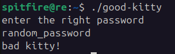
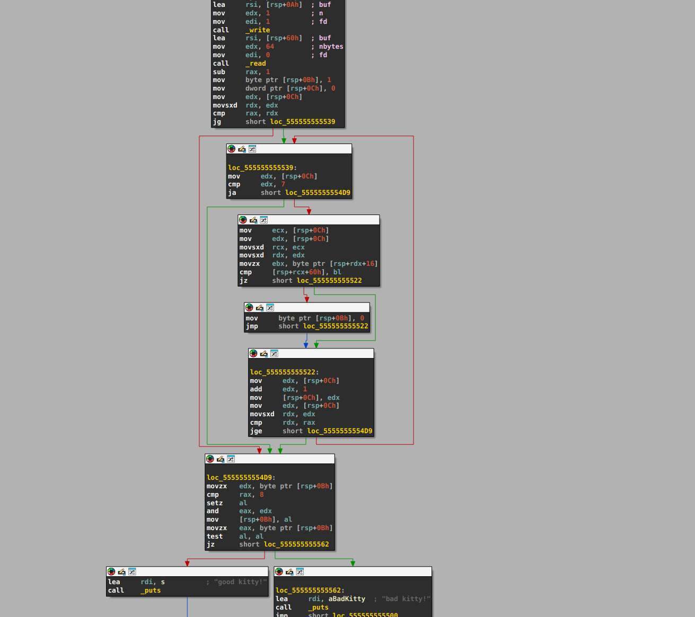
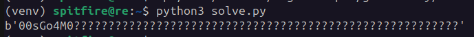
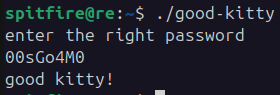

In this write-up I'm going to solve the <a href="https://crackmes.one/crackme/68c44e20224c0ec5dcedbf4b" target="_blank">good kitty</a> crackme. The objective is to discover the right password, and so the message "good kitty!" is written on stdout. Otherwise "bad kitty!" is shown instead, as in the print below.



I opened the binary in IDA to start static analysis and get an overview of the implementation and trying to figure out ways to discover the password. At first, there is a relatively long section of code that I'm not interested in understanding, so to avoid distractions I looked for the block where the password is read, hopping for a concrete clue.



As you can see in the graph, the first block calls \_read, which stores the user input in the buffer located at rsp+0x60, with a length of 64 bytes. After that, the execution flow doesn't return, so I plan to write a symbolic-execution script (with angr) to solve the remaining code. For angr script to start into the middle of the binary, I need to set up the stack data that is required afterward. To do this, I run gdb and collect the necessary values, for example, rsp+0xb.

```py
import angr
import claripy

def main():
    proj = angr.Project(
            'good-kitty',
            auto_load_libs=False,
            main_opts={
                "base_addr": 0x555555554000
            }
        )

    chars = [claripy.BVS('char_%d' % i, 8) for i in range(64)]
    input_arg = claripy.Concat(*chars)

    state = proj.factory.blank_state(addr=0x555555555539)

    for k in chars:
        state.solver.add(k < 0x7f)
        state.solver.add(k > 0x20)

    STACK_BASE = 0x7fffffffdc80
    STACK_SIZE = 0x1000

    state.memory.map_region(
        STACK_BASE - STACK_SIZE,
        STACK_SIZE,
        7
    )

    state.regs.rsp = STACK_BASE
    state.regs.rax = claripy.BVS("rax", 64)

    state.memory.store(
        state.regs.rsp + 0xb,
        claripy.BVV(1, 8)
    )
    state.memory.store(
        state.regs.rsp + 0xc,
        claripy.BVV(0, 32)
    )
    state.memory.store(
        state.regs.rsp + 0x60,
        input_arg
    )
    state.memory.store(
        state.regs.rsp + 0x10,
        b"00sGo4M0passwordenter the right password\x00"
    )

    sm = proj.factory.simulation_manager(state)
    sm.explore( find=lambda s: b"good kitty!" in s.posix.dumps(1), avoid=lambda s: b"bad kitty!" in s.posix.dumps(1) )

    if sm.found:
        input_value = sm.found[0].solver.eval(input_arg, cast_to=bytes)
        print(f"{input_value}")
    else:
        print("Bad kitty!")

if __name__ == "__main__":
    main()
```

At execute this script, the right password "00sGo4M0" is shown and the crackme is solved. You can find the binary and script in my <a href="https://github.com/matheus-git/angr-scripts/blob/main/good-kitty/solve.py" target="_blank">github</a> repository.




