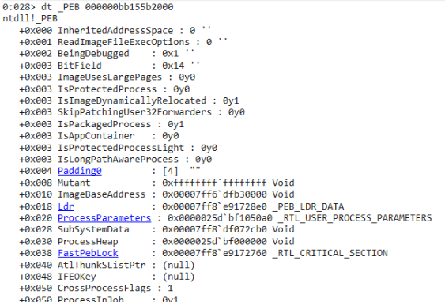
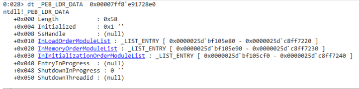
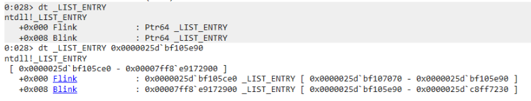
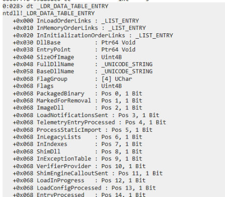
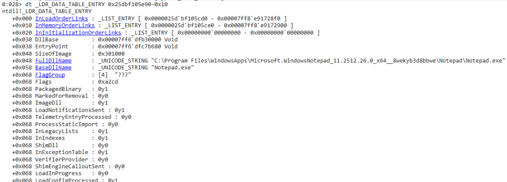
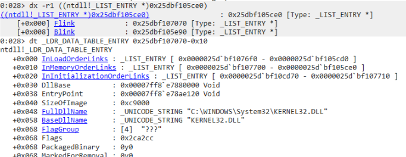
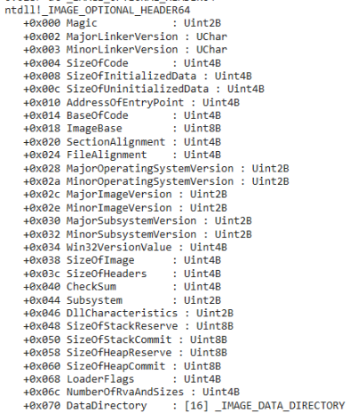

In this article, I will show how to walk the Process Environment Block (PEB) to resolve API functions dynamically, avoiding static imports that can be analyzed to identify the functions used by the PE. I will use Rust, and I recommend using `#![no_std]` and `#![no_main]` to produce a cleaner binary. For more details, check my tutorial: <a href="https://cyberspitfire.com/posts/minimal_binary/" target="_blank">How to Build Minimal Windows PE Files in Rust</a>.

:::note
The Process Environment Block (PEB) is a data structure allocated for each process by the Windows kernel to provide user-mode access to various process attributes, such as BeingDebugged, ImageBaseAddress, and the list of loaded modules. [[1]](https://learn.microsoft.com/en-us/shows/inside/peb)
:::

# PEB 

The <a href="https://learn.microsoft.com/en-us/windows/win32/api/winternl/ns-winternl-peb" target="_blank">official documentation</a> does not tell much about the data present in the PEB, so I used WinDbg to parse the structure with more details. Open WinDbg and attach to or execute any process, then execute the command `dt _PEB` to show the complete structure fields. To view the data, you need to pass the virtual address of the start of the PEB, which can be found in the first line of the output when executing `!peb`. After that, run `dt _PEB <addr>`, like below:



`Ldr` is what we looking for, it have a pointer to struct `_PEB_LDR_DATA` that have `InMemoryOrderModuleList` a linked-list to loaded modules [[2]](https://learn.microsoft.com/en-us/windows/win32/api/winternl/ns-winternl-peb_ldr_data). Now, define the PEB structure in code, define padding to skip unimportant fields, and retrieve the Ldr pointer:

```rust
#[repr(C)]
struct PEB {
    _pad: [u8; 0x18],
    ldr: *const PEB_LDR_DATA,
}
```

# PEB_LDR_DATA 

When debugging PEB_LDR_DATA, we can find the offset of InMemoryOrderModuleList, as shown below:



:::note[InMemoryOrderModuleList]
The head of a doubly-linked list that contains the loaded modules for the process. Each item in the list is a pointer to an `LDR_DATA_TABLE_ENTRY` structure.
:::

Now, define the structure:

```rust
#[repr(C)]
struct PEB_LDR_DATA {
    _pad: [u8; 0x20],
    in_memory_order_module_list: LIST_ENTRY,
}
```

# LIST_ENTRY



In practice, in this context, Flink and Blink are pointers inside the `LIST_ENTRY` structure used as `InMemoryOrderLinks` in `LDR_DATA_TABLE_ENTRY`. They point to the next and previous `LIST_ENTRY` entries in the circular doubly linked list of loaded modules.[[3]](https://learn.microsoft.com/en-us/windows/win32/api/ntdef/ns-ntdef-list_entry) This will make more sense when we look at `LDR_DATA_TABLE_ENTRY` next.

Define the structure:

```rust
#[repr(C)]
struct LIST_ENTRY {
    flink: *const LIST_ENTRY,
    blink: *const LIST_ENTRY,
}
```

# LDR_DATA_TABLE_ENTRY

`LDR_DATA_TABLE_ENTRY` is a data structure that contains metadata about each module loaded in the process[[1]](https://learn.microsoft.com/en-us/windows/win32/api/winternl/ns-winternl-peb_ldr_data):



Recapping: when accessing `InMemoryOrderModuleList` from `PEB_LDR_DATA`, we are working with a doubly linked list that points to the `InMemoryOrderLinks` field of `LDR_DATA_TABLE_ENTRY`.

Therefore, to access the full structure, we need to adjust the pointer to match the start of the struct. Since `InMemoryOrderLinks` has an offset of 0x10, we can subtract 0x10 from the Flink or Blink pointer to obtain the base address of `LDR_DATA_TABLE_ENTRY`:



As you can see, the first module in the list is the main executable itself. Note that the `DllBase` matches the `ImageBaseAddress` from the PEB structure. Following the Flink pointer twice, we get:



Now, we have the base address of Kernel32.dll in the process (`DllBase`). This is important, as in the next steps we will iterate its export table to locate any function we need.

Define the structures, `base_dll_name` will be used to locate the Kernel32.dll:

```rust
#[repr(C)]
pub struct UNICODE_STRING {
    pub length: u16,
    pub maximum_length: u16,
    pub buffer: *mut u16,
}

#[repr(C)]
struct LDR_DATA_TABLE_ENTRY {
    _pad1: [u8; 0x30],
    dll_base: *const c_void,
    _pad2: [u8; 0x20],
    base_dll_name: UNICODE_STRING,
}
```

# fn get_base_module(dll_name: &[u8])

With the knownledge, I write that function of proof of concept:

```rust collapse={1-13, 45-81}
use core::ffi::c_void;
use core::arch::asm;

fn get_peb() -> *const PEB {
    unsafe{ 
        let peb;
        asm!("mov {}, gs:[0x60]", out(reg) peb);
        peb
    }
}

const IN_MEMORY_ORDER_LINKS_OFFSET: usize = 0x10;

fn get_base_module(dll_name: &[u8]) -> Option<*const c_void> {
    unsafe {
        let peb = get_peb();
        let ldr = (*peb).ldr;

        if ldr.is_null() {
            return None;
        }

        let head = &(*ldr).in_memory_order_module_list as *const LIST_ENTRY;
        let mut current = (*head).flink;

        while current != head {
            let entry = (current as usize - IN_MEMORY_ORDER_LINKS_OFFSET) as *const LDR_DATA_TABLE_ENTRY;

            let base_name = &(*entry).base_dll_name;

            if cmp_utf16_ascii_case_insensitive(
                base_name.buffer,
                (base_name.length / 2) as usize,
                dll_name,
            ) {
                return Some((*entry).dll_base);
            }

            current = (*current).flink;
        }

        None
    }
}

fn cmp_utf16_ascii_case_insensitive(
    buf: *const u16,
    len: usize,
    ascii: &[u8],
) -> bool {
    if len != ascii.len() {
        return false;
    }

    let mut i = 0;

    while i < len {
        let c1 = unsafe { *buf.add(i) as u8 };
        let c2 = ascii[i];

        let c1 = if c1 >= b'a' && c1 <= b'z' {
            c1 - 32
        } else {
            c1
        };

        let c2 = if c2 >= b'a' && c2 <= b'z' {
            c2 - 32
        } else {
            c2
        };

        if c1 != c2 {
            return false;
        }

        i += 1;
    }

    true
}
```

Example:

```rust
let kernel32_base = match get_base_module(b"KERNEL32.DLL") {
    Some(addr) => addr,
    None => return 1,
};
```

# Kernel32.dll

:::tip[Known DLLs]
Windows keeps some important DLLs loaded by default in most processes. These are known as `Known DLLs`: "If the DLL is on the list of known DLLs for the version of Windows on which the application is running, then the system uses its copy of the known DLL (and the known DLL's dependent DLLs, if any)." [[4]](https://learn.microsoft.com/en-us/windows/win32/dlls/dynamic-link-library-search-order).
:::

Now that we have the base address of Kernel32.dll, we need to traverse its export table to resolve the addresses of the functions we want to use. This requires parsing several PE headers, as shown below.

# IMAGE_DOS_HEADER

That struct start in the begining of the module address, the field important here is `e_lfanew`, which point to `IMAGE_NT_HEADERS64`. Define:

```rust
#[repr(C)]
struct IMAGE_DOS_HEADER {
    _pad: [u8; 0x3c],
    e_lfanew: i32,
}
```

# IMAGE_NT_HEADERS64

We continue navigating, now the important field is `OptionalHeader`:

```rust
#[repr(C)]
struct IMAGE_NT_HEADERS64 {
    _pad: [u8; 0x18],
    optional: IMAGE_OPTIONAL_HEADER64,
}
```

# IMAGE_OPTIONAL_HEADER64

Finally, we arrive at the export table, which is referenced in the `DataDirectory`, an array of `IMAGE_DATA_DIRECTORY`:



Since the export table is the first entry [[5]](https://learn.microsoft.com/en-us/windows/win32/api/winnt/ns-winnt-image_data_directory), we can simply:

```rust
#[repr(C)]
struct IMAGE_OPTIONAL_HEADER64 {
    _pad: [u8; 0x70],
    export: IMAGE_DATA_DIRECTORY,
}
```

# IMAGE_DATA_DIRECTORY

This structure gives us the relative address of `IMAGE_EXPORT_DIRECTORY`, which can be obtained by adding `dll_base` and `virtual_address`:

```rust
#[repr(C)]
struct IMAGE_DATA_DIRECTORY {
    virtual_address: u32,
    size: u32,
}
```

# IMAGE_EXPORT_DIRECTORY

We are almost there, we just need to understand a few details about the structure.

Basically, `address_of_names` is a contiguous region in memory containing 32-bit relative pointers (RVAs) to the ASCII names of each exported function. The idea is to iterate through these entries: for each 32-bit pointer, compute the actual address by adding it to `dll_base`. If the name does not match the target, move to the next entry and continue.

Once a match is found, keep its index and use it to access the corresponding entry in `address_of_name_ordinals`, which then allows retrieving the correct function address from `address_of_functions`.

```rust
#[repr(C)]
struct IMAGE_EXPORT_DIRECTORY {
    _pad: [u8; 0x18],
    number_of_names: u32,
    address_of_functions: u32,
    address_of_names: u32,
    address_of_name_ordinals: u32,
}
```

# fn get_proc_by_name()

With this function, it is possible to find any function/procedure from any DLL base address.

```rust collapse={31-51}
fn get_proc_by_name(base: *const c_void, target: &[u8]) -> *const c_void {
    unsafe{
        let base = base as usize;

        let dos = base as *const IMAGE_DOS_HEADER;
        let nt = (base + (*dos).e_lfanew as usize) as *const IMAGE_NT_HEADERS64;

        let export_dir =
            (base + (*nt).optional.export.virtual_address as usize)
                as *const IMAGE_EXPORT_DIRECTORY;

        let names = (base + (*export_dir).address_of_names as usize) as *const u32;
        let funcs = (base + (*export_dir).address_of_functions as usize) as *const u32;
        let ords = (base + (*export_dir).address_of_name_ordinals as usize) as *const u16;

        for i in 0..(*export_dir).number_of_names {
            let name_rva = *names.add(i as usize);
            let name_ptr = (base + name_rva as usize) as *const u8;

            if strcmp(name_ptr, target.as_ptr()) {
                let ord = *ords.add(i as usize) as usize;
                let func_rva = *funcs.add(ord);

                return (base + func_rva as usize) as *const c_void;
            }
        }

        core::ptr::null_mut()
    }
}

fn strcmp(a: *const u8, b: *const u8) -> bool {
    unsafe{
        let mut i = 0;

        loop {
            let c1 = *a.add(i);
            let c2 = *b.add(i);

            if c1 != c2 {
                return false;
            }

            if c1 == 0 {
                return true;
            }

            i += 1;
        }
    }
}

```

# main 

So, use LoadLibraryA to load user32.dll to display MessageBox:

```rust
#[unsafe(no_mangle)]
pub extern "C" fn main() -> i32 {
    unsafe {
        let k32 = match get_base_module(b"KERNEL32.DLL") {
            Some(addr) => addr,
            None => return 1
        };

        let loadlib_addr = get_proc_by_name(k32, b"LoadLibraryA\0");

        type LoadLibraryAT =
            unsafe extern "system" fn(*const u8) -> *mut c_void;

        let load_library: LoadLibraryAT = core::mem::transmute(loadlib_addr);

        load_library(b"user32.dll\0".as_ptr());

        let user32 = match get_base_module(b"USER32.DLL") {
            Some(addr) => addr,
            None => return 1
        };

        let msgbox_addr =
            get_proc_by_name(user32, b"MessageBoxA\0");

        type MessageBoxAT = unsafe extern "system" fn(
            *mut c_void,
            *const u8,
            *const u8,
            u32,
        ) -> i32;

        let message_box: MessageBoxAT = core::mem::transmute(msgbox_addr);

        let text = b"text!\0";
        let title = b"title\0";

        message_box(
            core::ptr::null_mut(),
            text.as_ptr(),
            title.as_ptr(),
            0,
        );
    }

    0
}
```

# Source code

Check out the full code in my GitHub <a href="https://github.com/matheus-git/peb_walk" target="_blank">repository</a>.

***

#### Article source:

::github{repo="matheus-git/spitfire"}
