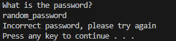
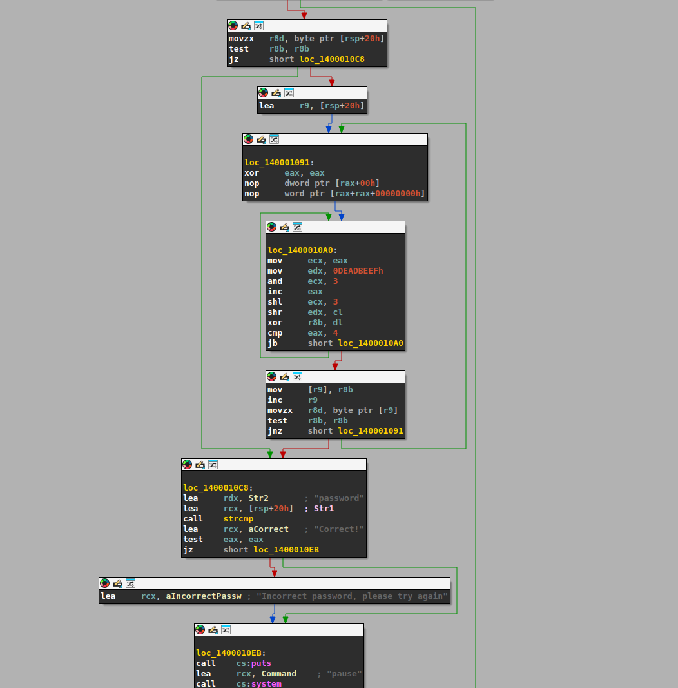
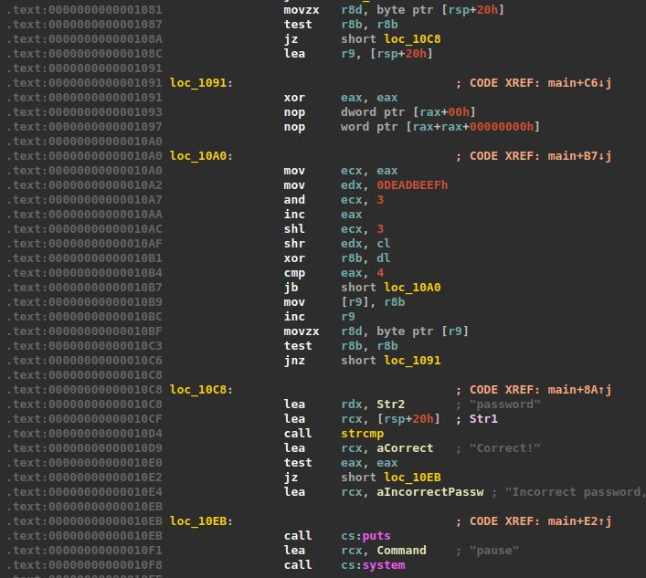
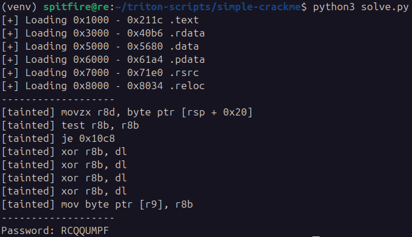
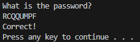

In this write-up I'm going to solve <a href="https://crackmes.one/crackme/694dc5b60c16072f40f5a43c" target="_blank">simple crackme</a> crackme. I used Angr in the previous reversing, but this is a windows binary, and Angr is not very suitable for the Windows OS. Therefore, i decided to use <a href="https://github.com/JonathanSalwan/Triton" target="_blank">Triton</a>, another symbolic execution framework, which allows more controle over the execution and taint analysis.

# Crackme overview



The <a href="https://crackmes.one/crackme/694dc5b60c16072f40f5a43c" target="_blank">simple crackme</a> is a very simple program, it reads a password from stdin and show whether it is correct or wrong. When analyzed with IDA, a quick overview on the graph mode reveals that the stdin buffer (rsp + 0x20) goes through a loop that xor's each input byte, and then compare with it with the string "password". In other words, the correct password is a string that, after some operations, is transformed into "password".



Below is a list of the instructions and their addresses:


# Solver

In order to solve this crackme, i wrote a Triton script in Python, emulating the program execution and symbolizes the input buffer. In addition, I used taint analysis to monitor whether the program reads from or writes to the first byte of the buffer. In order to better understand better how the program manipulate the input. Below, I explain each function of the script, you can view the complete script <a href="https://github.com/matheus-git/triton-scripts/blob/main/simple-crackme/solve.py" target="_blank">here</a>.

After initializing the Triton context, I used the lief library to parse the binary and called loadBinary to load its sections into memory.

```py
def loadBinary(ctx, binary):
    for sec in binary.sections:
        ctx.setConcreteMemoryAreaValue(
            sec.virtual_address,
            list(sec.content)
        )
        print(f"[+] Loading"
              f" {hex(sec.virtual_address)} - {hex(sec.virtual_address + sec.virtual_size)}"
              f" {sec.name}")
```

Then, I called the setup function to configure the stack, populate the input buffer, and taint the first byte. RSP is a global variable with an arbitrary value of 0x7ffffff0, note that the buffer address is the same as the one identified during static analysis in IDA, rsp + 0x20.

After setting the rsp and rbp registers, a loop is executed to populate each byte with a dummy value (0x41, which corresponds to 'A' in the ASCII table). Each byte is then symbolized to inform Triton to monitor operations on this memory address, an alias is set to facilitate debugging, and to finish, taintMemory is used to taint the byte at BUFFER_ADDR.

```py
RSP = 0x7ffffff0
BUFFER_ADDR = RSP + 0x20
BUFFER_SIZE = 8

...

def setup(ctx):
    ctx.setConcreteRegisterValue(ctx.registers.rsp, RSP)
    ctx.setConcreteRegisterValue(ctx.registers.rbp, RSP)

    addr = BUFFER_ADDR
    for i in range(BUFFER_SIZE):
        ctx.setConcreteMemoryValue(addr, 0x41)
        sym = ctx.symbolizeMemory(MemoryAccess(addr, CPUSIZE.BYTE))
        sym.setAlias(f"input_{i}")
        addr += 1

    ctx.taintMemory(BUFFER_ADDR)
```

The run function receives the address from which the program should start execution. I chose 0x1081 to skip the binary initialization code and avoid having to hook operating system functions, allowing me to focus on the part where the input is transformed. You can check the addresses and instructions in the screenshots at the beginning of the article.

The condition of the while loop is that the program counter (pc) is less than or equal to the maximum address of the .text section, obtained from the loadBinary function. Each instruction retrieved from the pc address is emulated using ctx.processing(inst). 

If the instruction reads from or writes to memory that has been tainted, it is printed to the console. The program is emulated until CHECK_ADDR is executed, just before the comparison, because by then the input has already been transformed. At this point, Triton knows all the operations that have been executed on the input.

```py
START_ADDR  = 0x1081
CHECK_ADDR  = 0x10C8

...

def run(ctx, pc):
    while pc <= 0x211c:
        inst = Instruction(pc, ctx.getConcreteMemoryAreaValue(pc, 15))
        ctx.processing(inst)

        if inst.isTainted():
            print("[tainted] %s" % inst.getDisassembly())
        
        if inst.getAddress() == CHECK_ADDR:
            solve(ctx)
            break

        pc = ctx.getConcreteRegisterValue(ctx.registers.rip)
```

Finally, the solve function iterates over each symbolized byte and queries Triton for the value it must have to match the corresponding character in the PASSWORD variable.

```py
PASSWORD = b"password"

...

def solve(ctx):
    result = ""
    for k, v in enumerate(PASSWORD):
        input = ctx.getSymbolicMemory(BUFFER_ADDR+k).getAst()
        model = ctx.getModel(input == v)
        value = next(iter(model.values())).getValue()
        result += chr(value)    
    print("-------------------")
    print("Password: %s" % result)
```

At execute this script, it show the sections loaded, tainted instructions and the correct password.




<a href="https://github.com/matheus-git/triton-scripts/blob/main/simple-crackme/solve.py" target="_blank">Source code</a>.
